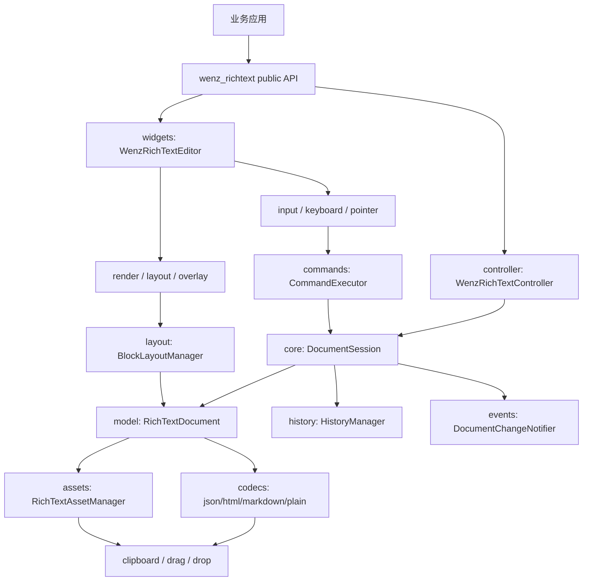
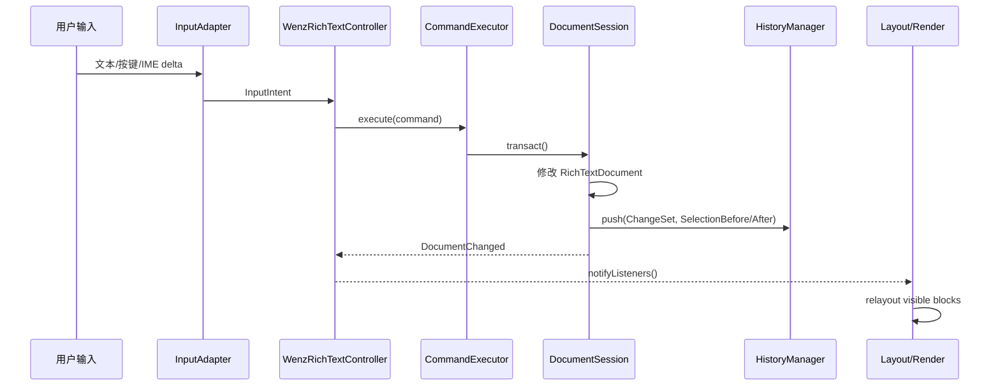
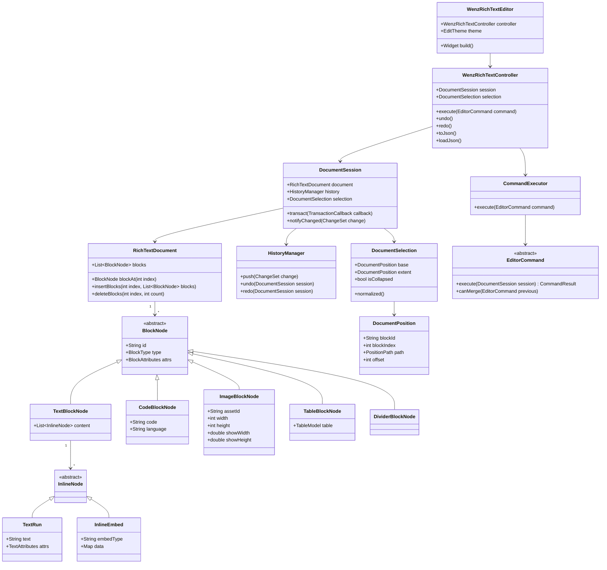
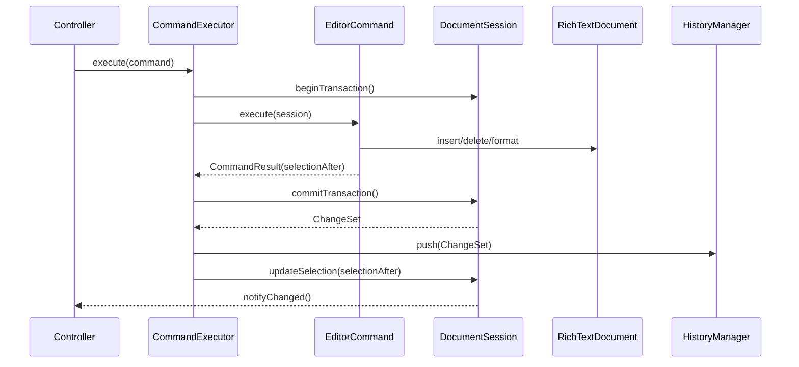
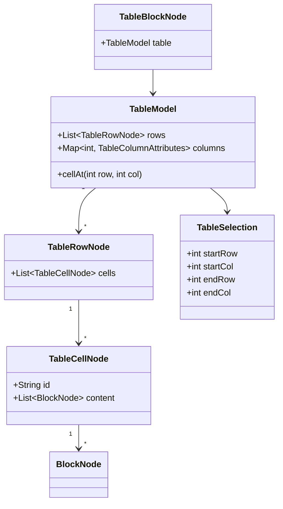

# wenz_richtext 重构总体方案

## 1. 背景与目标

当前 `wenz_editor` 是一个 Flutter 富文本编辑器工程，核心编辑能力已经覆盖文本、标题、引用、列表、图片、表格、代码块、分割线、公式、链接、复制粘贴、拖拽、撤销重做、Markdown/HTML/PDF 导出等场景。

现有工程同时存在两套编辑路径：

- `WenzEditController` + `BlockManager` + `WenzBlock`：以 `List<WenzBlock>` 和 `WenElement` JSON 为主的本地编辑路径。
- `YsEditController` + `YsTree` + `YsText/YsTable/YsCode/...`：以 `ydart` 的 `YDoc/YArray/YMap/YText` 为文档模型和事务源的编辑路径。

目标是重构为新包 `wenz_richtext`，完全移除 `ydart`，自研编辑器核心，保留现有项目中成熟的渲染、交互和平台适配经验。

### 1.1 重构目标

- 包名从 `wenz_editor` 迁移为 `wenz_richtext`。
- `pubspec.yaml` 中移除 `ydart` 依赖。
- `lib/` 与 `test/` 中不再 import `package:ydart/...`。
- 不再使用 `YDoc/YArray/YMap/YText/UndoManager` 作为文档模型、事务模型、撤销重做模型或剪贴板中间格式。
- 自研文档模型、位置模型、选择模型、编辑命令、事务、历史栈、序列化和渲染适配层。
- 优先复用已有 Flutter 渲染与交互资产，避免一次性重写所有 Block UI。
- 对外提供清晰、稳定的包 API，便于其他 Flutter 应用集成。

### 1.2 非目标

- 第一阶段不实现多人实时协作 CRDT。
- 第一阶段不追求兼容 `ydart` 二进制更新数据。若历史数据只存在 `YDoc` 更新流中，需要在旧版本中先导出为 JSON，再迁移到 `wenz_richtext`。
- 不在重构早期重写所有 painter、toolbar 和 popup，除非它们直接依赖旧模型。

## 2. 当前依赖与风险盘点

### 2.1 `ydart` 直接依赖点

当前直接依赖 `ydart` 的核心文件：

| 文件 | 当前用途 | 重构方向 |
| --- | --- | --- |
| `pubspec.yaml` | git path 依赖 `ydart` | 删除依赖 |
| `lib/editor/crdt/YsTree.dart` | 文档树、事务、undo、光标、编辑命令 | 由 `DocumentSession`、`CommandExecutor`、`HistoryManager` 替代 |
| `lib/editor/crdt/YsEditController.dart` | 将 `WenzEditController` 委托给 `YsTree` | 由 `RichTextController` 直接驱动自研 session |
| `lib/editor/crdt/YsText.dart` | 文本增删、split/merge、属性设置 | 由 `TextEditingService` 和 `TextRun` 操作替代 |
| `lib/editor/crdt/YsTable.dart` | 表格结构和单元格操作 | 由 `TableEditingService` 替代 |
| `lib/editor/crdt/YsCode.dart` | 代码块输入、删除、缩进 | 由 `CodeBlockCommandService` 替代 |
| `lib/editor/crdt/YsImage.dart` | 图片块删除、插入、对齐、尺寸 | 由 `ImageBlockCommandService` 替代 |
| `lib/editor/crdt/YsLine.dart` | 分割线删除、插入 | 由 `DividerCommandService` 替代 |
| `lib/editor/crdt/YsCursor.dart` | ydoc 坐标光标 | 由 `DocumentPosition`、`TextPositionPath` 替代 |
| `lib/editor/crdt/YsSelection.dart` | ydoc 选择区 | 由 `DocumentSelection` 替代 |
| `lib/editor/crdt/YsBlock.dart` | `YMap` 到 `WenzBlock` 的同步适配 | 由 `BlockRendererFactory` 和 model adapter 替代 |
| `lib/editor/crdt/doc_utils.dart` | JSON 和 `YDoc` 互转 | 由 `RichTextJsonCodec`、`LegacyWenJsonCodec` 替代 |
| `lib/editor/block/element/element.dart` | `WenElement.getYMap()` | 改为 `toNode()` 或彻底迁移到新 model |
| `lib/editor/block/text/text.dart` | `WenTextElement.getYMap()` 生成 `YText` delta | 改为 `TextRun` 列表和 JSON codec |
| `lib/editor/block/table/table_element.dart` | 表格生成 `YArray/YMap` | 改为 `TableBlockNode` |
| `lib/editor/block/code/code.dart` | 代码块生成 `YText` | 改为 `CodeBlockNode` |
| `lib/commons/service/copy_service.dart` | `copyDocContent(YDoc?)`、`copyMarkdownContent(YDoc?)` | 改为 `RichTextDocument` 或 `List<BlockNode>` |
| `lib/commons/util/encrypt.dart` | 复用 `ydart/lib0` 字节流 | 自研 varint/string byte stream 或改用标准 codec |

### 2.2 可优先复用的资产

| 模块 | 可复用程度 | 说明 |
| --- | --- | --- |
| `lib/editor/block/*` 渲染类 | 高 | `TextBlock`、`TableBlock`、`ImageBlock`、`CodeBlock` 的 layout、hit test、paint 经验可迁移 |
| `InputManager` | 高 | 已处理 `TextInputClient`、`DeltaTextInputClient`、iOS/Android/Web 差异 |
| `CursorState`、`SelectState` | 中 | 位置对象需要改造，但光标闪烁和选择交互可复用 |
| `BlockManager` | 中 | 虚拟布局、可见块计算可复用；数据源应从 `WenzBlock` 改为 document snapshot |
| `CopyService` | 中 | HTML/plain text/clipboard cache 可复用；输入输出类型要改 |
| `WenzAssetsFileManager` | 高 | 图片和文件资产管理基本独立于 `ydart` |
| Toolbar、popup、menu、mobile toolbar | 中 | 命令入口可复用，调用目标改为新 controller command |
| Markdown/HTML/PDF 工具 | 中 | 需要把 `WenElement` 访问改为新 model 访问 |

### 2.3 主要风险

- `WenzEditController` 过大，交互、输入、布局、命令、剪贴板、状态通知混在一个类中，直接替换底层模型会扩大回归面。
- `YsTree` 中已经沉淀了大量边界行为，如跨块删除、表格选择、代码块缩进、Markdown 快捷输入，需要逐条迁移为自研命令。
- 表格是最高风险模块，涉及二维位置、单元格内文本、跨单元格选择、行列增删、对齐、公式和复制粘贴。
- 移除 `ydart/lib0` 后，`encrypt.dart` 需要替换字节流实现，否则会残留间接依赖。
- 当前测试覆盖很弱，重构前需要先建立模型层和命令层测试网。

## 3. 功能列表

### 3.1 文档与块级内容

- 文档根节点。
- 普通段落。
- 标题，支持 `level`。
- 引用块。
- 有序列表、无序列表、任务列表。
- 缩进。
- 左对齐、居中、右对齐。
- 分割线。
- 代码块，支持语言、语法高亮、缩进和整块删除。
- 图片块，支持资产 id、原始宽高、显示宽高、对齐和尺寸更新。
- 表格块，支持行列、单元格内容、列对齐、行列增删、表格删除和表格尺寸调整。
- 预留视频块能力。当前源码中已有 `video_block.dart`、`video_element.dart`，但主解析路径未接入，应作为 P2/P3 后的可选扩展。

### 3.2 行内内容

- 纯文本。
- 加粗、斜体、下划线、删除线。
- 字号、字体预留。
- 前景色、背景色。
- 链接。
- 公式 embed。
- 行内图片 embed 预留。
- 隐藏文本模式，支持按颜色、背景、下划线隐藏。

### 3.3 光标与选择

- 单光标。
- 文本范围选择。
- 跨块选择。
- 表格单元格内选择。
- 表格跨单元格选择。
- 移动端拖拽选择柄。
- 鼠标 hover 链接识别。
- 双击选词、全选、Home/End/PageUp/PageDown、上下左右移动。
- 滚动到光标可见。

### 3.4 编辑命令

- 输入普通文本。
- IME composing 输入。
- 删除、Backspace。
- Enter 分裂块、创建新块或进入特殊块处理。
- 文本块 split/merge。
- 插入富文本片段。
- 插入图片、代码块、表格、分割线、链接、公式。
- Markdown 快捷输入：标题、列表、引用、代码块。
- 设置标题级别。
- 设置引用。
- 设置列表类型。
- 设置对齐。
- 设置行内样式。
- 清除样式。
- 表格行列增删。
- 更新表格单元格公式。
- 更新代码语言。
- 更新图片尺寸。

### 3.5 历史记录

- undo。
- redo。
- 命令合并策略，例如连续输入合并、样式操作独立记录。
- 历史记录中保存光标和滚动恢复信息。
- 支持最大历史条数。

### 3.6 剪贴板、导入导出与资产

- 复制选择区为 HTML 和纯文本。
- 复制 Markdown。
- 复制整个文档。
- 粘贴纯文本。
- 粘贴 HTML。
- 粘贴图片文件或图片二进制。
- 拖入图片或文件。
- JSON 保存和读取。
- 旧 `WenElement` JSON 读取。
- HTML 导出。
- Markdown 导出。
- PDF 导出。
- 图片资产写入、读取和迁移。

### 3.7 UI 与平台能力

- 编辑器 Widget。
- 桌面工具栏、移动工具栏。
- 浮动工具、链接浮窗、公式弹窗、表格操作菜单。
- 右键菜单。
- 搜索高亮。
- 只读模式。
- 焦点通知。
- 文本长度统计。
- Web、Android、iOS、Windows、macOS、Linux 基础可用。

## 4. 模块划分

### 4.1 目标分层



### 4.2 模块职责

| 模块 | 目标路径 | 职责 |
| --- | --- | --- |
| Public API | `lib/wenz_richtext.dart` | 导出稳定 API，隐藏内部实现 |
| Widget | `lib/src/widgets/` | 编辑器 Widget、viewport、overlay、toolbar 接入 |
| Controller | `lib/src/controller/` | 对外命令入口、状态暴露、生命周期 |
| Core Model | `lib/src/core/model/` | 文档、块、行内内容、属性、表格、资产引用 |
| Position | `lib/src/core/position/` | 文档位置、文本路径、选择区、范围比较 |
| Transaction | `lib/src/core/transaction/` | 事务、patch、change set、事件 |
| Commands | `lib/src/core/commands/` | 输入、删除、格式化、插入、表格、代码、图片等编辑命令 |
| History | `lib/src/history/` | undo/redo、命令合并、光标恢复 |
| Layout | `lib/src/layout/` | 块布局、虚拟列表、可见范围计算 |
| Render | `lib/src/render/` | Block renderer、painter、hit test、selection/caret 绘制 |
| Input | `lib/src/input/` | TextInputClient、IME、快捷键、平台输入差异 |
| Selection | `lib/src/selection/` | 选择拖拽、鼠标选词、移动端选择柄 |
| Clipboard | `lib/src/clipboard/` | copy/paste、clipboard cache、drag/drop |
| Codecs | `lib/src/codecs/` | JSON、legacy JSON、HTML、Markdown、plain text、PDF |
| Assets | `lib/src/assets/` | 图片/文件资产存储和路径解析 |
| Platform | `lib/src/platform/` | Web、desktop、mobile 差异适配 |
| Legacy | `lib/src/legacy/` | 从现有 `WenElement` JSON 迁移到新 model |
| Tests | `test/` | 模型、命令、codec、widget、golden、integration 测试 |

## 5. 架构设计

### 5.1 核心原则

- 文档模型不依赖 Flutter Widget，不依赖 `BuildContext`。
- 编辑命令只操作 `DocumentSession` 和 `RichTextDocument`，不直接触碰 Widget。
- 渲染层从 document snapshot 构建 render blocks，允许渐进复用现有 `TextBlock/TableBlock/...`。
- 光标位置使用稳定路径，不使用 `block.top` 或 widget 对象作为真实数据坐标。
- 所有写操作走事务，事务产出 `ChangeSet`，历史栈和 UI 通知都基于 `ChangeSet`。
- 序列化只依赖 model，不依赖 render block。
- 表格作为独立子模型处理，避免把二维坐标摊平后到处传 offset。

### 5.2 数据流



### 5.3 文档模型

文档模型推荐使用可控的可变模型加事务边界，而不是全量 immutable tree。原因是当前编辑器操作频繁、表格和行内样式拆分较多，完全 immutable 会带来大量对象复制。事务边界负责生成 patch 和历史记录。

基础结构：

- `RichTextDocument`：根文档，持有 `List<BlockNode>`。
- `BlockNode`：块级抽象，包含 `id`、`type`、`attrs`。
- `TextBlockNode`：段落、标题、引用、列表都可基于文本块扩展。
- `CodeBlockNode`：代码文本和语言。
- `ImageBlockNode`：资产 id、宽高、展示尺寸。
- `DividerBlockNode`：分割线。
- `TableBlockNode`：表格块，持有 `TableModel`。
- `TableCellNode`：单元格，首期只放一个 `TextBlockNode` 或 `ImageBlockNode`，后期可扩展为块列表。
- `TextRun`：文本片段和 `TextAttributes`。
- `InlineEmbed`：公式、行内图片等非文本片段。

### 5.4 位置模型

位置模型用于替换 `YsCursor`。

- `DocumentPosition`
  - `blockIndex`
  - `blockId`
  - `path`
  - `offset`
- `PositionPath`
  - 普通文本：`block/<blockId>/text`
  - 代码块：`block/<blockId>/code`
  - 表格单元格：`block/<tableId>/row/<r>/cell/<c>/text`
  - 图片/分割线：`block/<blockId>/object`
- `DocumentSelection`
  - `base`
  - `extent`
  - `isCollapsed`
  - `normalized`
- `SelectionAffinity`
  - 对齐 Flutter 的 upstream/downstream 语义。

### 5.5 命令模型

命令层用于替换 `YsTree` 中的大量方法。

命令分类：

- `InsertTextCommand`
- `DeleteCommand`
- `EnterCommand`
- `InsertBlocksCommand`
- `FormatTextCommand`
- `SetBlockTypeCommand`
- `SetAlignmentCommand`
- `SetListTypeCommand`
- `InsertTableCommand`
- `TableCommand`
- `InsertImageCommand`
- `ResizeImageCommand`
- `InsertCodeBlockCommand`
- `UpdateCodeLanguageCommand`
- `InsertDividerCommand`
- `SetLinkCommand`
- `ClearStyleCommand`

命令执行规则：

- 每个命令接收 `DocumentSession`、当前选择区和参数。
- 命令在事务内修改模型。
- 命令返回新的选择区。
- 命令声明是否可合并到上一条历史记录。
- 命令不直接调用 `setState`、不直接读 `BuildContext`。

### 5.6 渲染适配

为了降低风险，渲染层采用两步走：

1. 兼容适配期：把新 model 映射为现有 `WenElement` 和 `WenzBlock`，复用现有 `TextBlock/TableBlock/ImageBlock/CodeBlock` 的 layout 与 widget。
2. 原生渲染期：逐步让 `TextBlockRenderer/TableBlockRenderer/...` 直接读取新 model，删除 `WenElement` 中间层。

### 5.7 数据格式

新 JSON 格式建议：

```json
{
  "version": 1,
  "blocks": [
    {
      "id": "block-1",
      "type": "paragraph",
      "attrs": {
        "alignment": "left",
        "indent": 0,
        "listType": null,
        "checked": null
      },
      "content": [
        {
          "type": "text",
          "text": "hello",
          "attrs": {
            "bold": true,
            "color": null,
            "background": null,
            "url": null
          }
        }
      ]
    }
  ]
}
```

兼容策略：

- `LegacyWenJsonCodec` 读取当前 `WenElement.toJson()` 格式。
- `RichTextJsonCodec` 写入新格式。
- 旧格式读取后立即转为新 document；保存时默认写新格式。
- 若需要双写，提供 `saveFormat: legacy | richTextV1` 配置，但不长期维护旧格式写入。

## 6. UML 设计

### 6.1 核心类图



### 6.2 命令执行时序



### 6.3 表格位置模型



## 7. 阶段规划

### P0: 准备与基线

目标：建立新包骨架、测试基线和迁移边界。

任务：

- 创建 `wenz_richtext` Flutter package。
- 迁移 `analysis_options.yaml`，设置更严格 lint。
- 梳理旧工程中所有 `ydart` import 和 `Ys*` 调用点。
- 为现有 JSON 样例建立 fixture。
- 抽取当前功能行为用例，尤其是表格、代码块、跨块删除、复制粘贴。
- 建立 CI 命令：`flutter analyze`、`flutter test`。

交付物：

- 新 package 可 `flutter pub get`。
- 文档中的文件清单和任务列表进入仓库。
- fixtures 至少覆盖文本、标题、列表、图片、表格、代码、公式。

### P1: 自研文档模型与序列化

目标：用新 model 替代 `YDoc/YMap/YText` 的数据表达。

任务：

- 实现 `RichTextDocument`、`BlockNode`、`InlineNode`、`TableModel`。
- 实现 `DocumentPosition`、`DocumentSelection`。
- 实现 `RichTextJsonCodec`。
- 实现 `LegacyWenJsonCodec`，读取当前 `WenElement.toJson()` 格式。
- 实现 model 到旧 `WenElement` 的临时 adapter。
- 删除 `WenElement.getYMap()`、`WenTextElement.getYMap()`、`WenTableElement.getYMap()`、`WenCodeElement.getYMap()` 的迁移依赖。

交付物：

- 新旧 JSON 可互转。
- 文档 round-trip 不丢样式。
- `rg "package:ydart|YDoc|YMap|YArray|YText" lib test pubspec.yaml` 不命中新 model 和 codec。

### P2: 命令系统与历史栈

目标：用自研命令替代 `YsTree`。

任务：

- 实现 `DocumentSession`、事务、`ChangeSet`。
- 实现 `HistoryManager`，支持 undo/redo 和选择恢复。
- 实现文本输入、删除、Enter、split/merge。
- 实现格式化命令：bold、italic、underline、lineThrough、color、background、link、clearStyle。
- 实现块级命令：标题、引用、列表、缩进、对齐、插入块。
- 实现代码块、图片、分割线基础命令。
- 初步实现表格行列、单元格文本命令。

交付物：

- 命令层单元测试覆盖核心操作。
- 连续输入、跨块删除、撤销重做行为稳定。
- `YsTree` 不再作为编辑命令源。

### P3: Controller 与渲染接入

目标：让新 controller 驱动现有编辑 UI。

任务：

- 实现 `WenzRichTextController`。
- 将 `WenzEditWidget` 迁移为 `WenzRichTextEditor`。
- 将 `BlockManager` 改为从 document snapshot 构建 render blocks。
- 适配 cursor、selection、hover、scroll、focus。
- 保留现有 `TextBlock/TableBlock/ImageBlock/CodeBlock/LineBlock` 的首轮渲染能力。
- 将 toolbar、popup、context menu 调用改为 controller command。

交付物：

- 一个示例页面可以编辑新 document。
- 普通文本、标题、列表、图片、代码、表格可显示和基础编辑。
- 光标、选择、高亮和滚动可用。

### P4: 剪贴板、导入导出与资产

目标：替换所有 `YDoc` 剪贴板和导出入口。

任务：

- `CopyService.copyDocContent` 改为接收 `RichTextDocument` 或 `List<BlockNode>`。
- `CopyService.copyMarkdownContent` 改为接收新 model。
- 粘贴 HTML/Markdown/plain text 到 `BlockNode`。
- 拖拽图片接入 `RichTextAssetManager`。
- PDF 导出从新 model 或 render blocks 输出。
- 替换 `encrypt.dart` 对 `ydart/lib0` 的依赖。

交付物：

- 复制 HTML、纯文本、Markdown 可用。
- 粘贴文本、HTML、图片可用。
- 导出 Markdown、HTML、PDF 可用。
- `commons` 中无 `ydart` import。

### P5: 表格、代码和移动端细节补齐

目标：补齐高风险交互。

任务：

- 表格跨单元格选择。
- 表格复制粘贴矩阵内容。
- 表格行列增删与对齐。
- 表格内图片和公式。
- 代码块缩进、取消缩进、语言切换。
- 移动端选择柄、IME composing 回归。
- Markdown 快捷输入完整迁移。

交付物：

- 表格专项测试通过。
- Android/iOS/Web 输入回归通过。
- 代码块和表格在 undo/redo 下无错位。

### P6: 清理、发布与验收

目标：完成 `ydart` 移除和新包收口。

任务：

- 删除 `lib/editor/crdt/` 或仅保留无 `ydart` 的 legacy adapter。
- 删除所有 `Ys*` 命名公开 API。
- 更新 README、CHANGELOG、示例。
- 建立 benchmark 和 golden test。
- API 文档注释补齐。
- 跑全量验收命令。

交付物：

- `wenz_richtext` 可作为独立 Flutter package 使用。
- `ydart` 完全移除。
- 示例工程可运行。
- 验收标准全部通过。

## 8. 任务清单

| 编号 | 任务 | 阶段 | 优先级 | 验收 |
| --- | --- | --- | --- | --- |
| T001 | 新建 `wenz_richtext` package 骨架 | P0 | P0 | `flutter pub get` 成功 |
| T002 | 建立 legacy JSON fixtures | P0 | P0 | fixtures 覆盖主块类型 |
| T003 | 实现 `RichTextDocument` | P1 | P0 | model 单测通过 |
| T004 | 实现 `TextRun` 和属性合并/拆分 | P1 | P0 | 行内样式 round-trip 通过 |
| T005 | 实现 `TableModel` | P1 | P0 | 行列和 cell 访问单测通过 |
| T006 | 实现 `DocumentPosition` 和选择比较 | P1 | P0 | 跨块和表格位置排序正确 |
| T007 | 实现 `RichTextJsonCodec` | P1 | P0 | 新 JSON round-trip 通过 |
| T008 | 实现 `LegacyWenJsonCodec` | P1 | P0 | 当前 JSON 可读入新 model |
| T009 | 实现事务和 `ChangeSet` | P2 | P0 | 每个命令可生成变更 |
| T010 | 实现 `HistoryManager` | P2 | P0 | undo/redo 和光标恢复通过 |
| T011 | 实现文本输入命令 | P2 | P0 | 连续输入可合并历史 |
| T012 | 实现删除命令 | P2 | P0 | 前删、后删、选区删除通过 |
| T013 | 实现 Enter 命令 | P2 | P0 | 文本、标题、列表、代码、表格行为通过 |
| T014 | 实现行内格式命令 | P2 | P0 | 样式拆分和合并正确 |
| T015 | 实现块级格式命令 | P2 | P1 | 标题、引用、列表、对齐通过 |
| T016 | 实现代码块命令 | P2 | P1 | 代码增删和缩进通过 |
| T017 | 实现图片块命令 | P2 | P1 | 插入、删除、调整尺寸通过 |
| T018 | 实现表格基础命令 | P2 | P0 | 行列增删和 cell 编辑通过 |
| T019 | 实现 `WenzRichTextController` | P3 | P0 | UI 可通过 controller 编辑 |
| T020 | 迁移 `WenzEditWidget` | P3 | P0 | 示例页面可编辑 |
| T021 | 迁移 `BlockManager` 数据源 | P3 | P0 | 大文档可虚拟布局 |
| T022 | 迁移 selection/caret 渲染 | P3 | P0 | 光标和选区显示正确 |
| T023 | 迁移 toolbar/popup 命令入口 | P3 | P1 | UI 操作调新命令 |
| T024 | 改造 `CopyService` | P4 | P0 | 不再接收 `YDoc` |
| T025 | 实现 HTML/Markdown/plain codecs | P4 | P1 | 复制导出一致 |
| T026 | 替换 `encrypt.dart` 字节流 | P4 | P0 | 无 `ydart/lib0` import |
| T027 | 表格跨单元格选择 | P5 | P1 | 表格专项测试通过 |
| T028 | 移动端 IME 回归 | P5 | P1 | Android/iOS 基础输入通过 |
| T029 | 删除 `ydart` 和 `Ys*` 残留 | P6 | P0 | `rg` 验收命令无结果 |
| T030 | 补齐 README/example/API docs | P6 | P1 | 新用户可按文档接入 |

## 9. 目标文件列表

### 9.1 新包结构

```text
wenz_richtext/
  pubspec.yaml
  README.md
  CHANGELOG.md
  example/
    lib/main.dart
  lib/
    wenz_richtext.dart
    src/
      assets/
        rich_text_asset.dart
        rich_text_asset_manager.dart
      clipboard/
        clipboard_service.dart
        clipboard_cache.dart
        drag_drop_service.dart
      codecs/
        rich_text_json_codec.dart
        legacy_wen_json_codec.dart
        html_codec.dart
        markdown_codec.dart
        plain_text_codec.dart
        pdf_exporter.dart
      controller/
        wenz_rich_text_controller.dart
        controller_state.dart
      core/
        commands/
          editor_command.dart
          command_executor.dart
          text_commands.dart
          block_commands.dart
          style_commands.dart
          table_commands.dart
          image_commands.dart
          code_commands.dart
        model/
          rich_text_document.dart
          block_node.dart
          inline_node.dart
          attributes.dart
          table_model.dart
          node_id.dart
        position/
          document_position.dart
          document_selection.dart
          position_path.dart
        transaction/
          document_session.dart
          transaction.dart
          change_set.dart
          patch.dart
      history/
        history_manager.dart
        history_entry.dart
      input/
        input_manager.dart
        keymap.dart
        input_intent.dart
      layout/
        block_layout_manager.dart
        layout_snapshot.dart
      legacy/
        wen_element_adapter.dart
        legacy_block_adapter.dart
      platform/
        platform_adapter.dart
        web_adapter.dart
        io_adapter.dart
      render/
        block_renderer.dart
        block_renderer_factory.dart
        text_block_renderer.dart
        table_block_renderer.dart
        image_block_renderer.dart
        code_block_renderer.dart
        divider_block_renderer.dart
        caret_renderer.dart
        selection_renderer.dart
      selection/
        selection_controller.dart
        hit_test_service.dart
        drag_selection_handle.dart
      theme/
        edit_theme.dart
      toolbar/
        toolbar.dart
        mobile_toolbar.dart
      widgets/
        wenz_rich_text_editor.dart
        edit_content_widget.dart
        overlay_layer.dart
        modal_widget.dart
        popup/
  test/
    core/
      model_test.dart
      position_test.dart
      transaction_test.dart
      text_commands_test.dart
      table_commands_test.dart
      history_manager_test.dart
    codecs/
      rich_text_json_codec_test.dart
      legacy_wen_json_codec_test.dart
      markdown_codec_test.dart
      html_codec_test.dart
    widgets/
      editor_smoke_test.dart
    fixtures/
      legacy_basic.json
      legacy_table.json
      legacy_code_image_formula.json
```

### 9.2 旧文件迁移映射

| 旧文件 | 新位置/处理 |
| --- | --- |
| `lib/editor/edit_widget.dart` | `lib/src/widgets/wenz_rich_text_editor.dart` |
| `lib/editor/edit_content_widget.dart` | `lib/src/widgets/edit_content_widget.dart` |
| `lib/editor/edit_controller.dart` | 拆分到 `controller/`、`core/commands/`、`selection/`、`clipboard/` |
| `lib/editor/block/block_manager.dart` | `lib/src/layout/block_layout_manager.dart` |
| `lib/editor/block/block.dart` | `lib/src/render/block_renderer.dart`，长期删除 model 责任 |
| `lib/editor/block/text/text.dart` | 拆分为 `model/inline_node.dart` 与 `render/text_block_renderer.dart` |
| `lib/editor/block/table/table_block.dart` | `render/table_block_renderer.dart` 与 `core/commands/table_commands.dart` |
| `lib/editor/block/table/table_element.dart` | `core/model/table_model.dart` |
| `lib/editor/block/code/code.dart` | `core/model/block_node.dart` 与 `render/code_block_renderer.dart` |
| `lib/editor/block/image/*` | `assets/` 与 `render/image_block_renderer.dart` |
| `lib/editor/block/line/*` | `DividerBlockNode` 与 `divider_block_renderer.dart` |
| `lib/editor/input/input_manager.dart` | `lib/src/input/input_manager.dart` |
| `lib/editor/cursor/*` | `core/position/` 与 `selection/` |
| `lib/editor/state/select_state.dart` | `selection/selection_controller.dart` |
| `lib/editor/crdt/*` | 删除或按命令迁移，不保留 ydart 依赖 |
| `lib/editor/crdt/doc_utils.dart` | `codecs/legacy_wen_json_codec.dart` |
| `lib/commons/service/copy_service.dart` | `clipboard/clipboard_service.dart` |
| `lib/commons/service/file_manager.dart` | `assets/rich_text_asset_manager.dart` |
| `lib/commons/util/encrypt.dart` | 替换为自研 byte stream 或删除 |
| `lib/editor/toolbar/*` | `toolbar/` |
| `lib/editor/widget/popup/*` | `widgets/popup/` |
| `lib/editor/theme/theme.dart` | `theme/edit_theme.dart` |

## 10. 验收标准

### 10.1 依赖验收

必须通过：

```powershell
rg "ydart|package:ydart|YDoc|YMap|YArray|YText|UndoManager" pubspec.yaml lib test
```

期望结果：无命中。文档目录允许出现历史说明，但源码、测试和 pubspec 不允许出现。

### 10.2 编译与测试验收

必须通过：

```powershell
flutter pub get
flutter analyze
flutter test
```

建议补充：

```powershell
flutter test test/core
flutter test test/codecs
flutter test test/widgets
```

### 10.3 功能验收

- 可创建空文档并输入文本。
- 可读取旧 `WenElement` JSON，并保存为新 JSON。
- 文本样式可设置和撤销。
- 标题、引用、列表、缩进、对齐可用。
- 插入、删除、撤销图片块可用。
- 插入、编辑、删除代码块可用。
- 插入表格、编辑单元格、增删行列、删除表格可用。
- 跨块选择、复制、剪切、粘贴可用。
- HTML、Markdown、纯文本复制导出可用。
- PDF 导出可用。
- Android/iOS 基础 IME 输入可用。
- Web 基础输入和复制粘贴可用。
- 桌面鼠标选择、右键菜单、快捷键可用。

### 10.4 数据验收

- 新 JSON round-trip 后内容、样式、表格结构、图片引用不丢失。
- 旧 JSON 迁移后内容、样式、表格结构、图片引用不丢失。
- Markdown 导出符合常见 Markdown 阅读器渲染。
- HTML 复制可粘贴到浏览器、Word 类应用和另一个编辑器实例。
- 图片资产 id 与文件路径映射稳定。

### 10.5 性能验收

建议目标：

- 1000 个文本块首屏打开小于 500ms。
- 10000 个文本块滚动无明显卡顿，虚拟布局只布局可见块附近内容。
- 连续输入平均命令执行小于 8ms。
- 大表格 100x20 基础导航和单元格输入可用。
- undo/redo 不做全量深拷贝文档。

### 10.6 质量验收

- 核心 model 和 commands 不依赖 Flutter Widget。
- 命令层单元测试覆盖文本、表格、代码、图片、历史栈。
- 复杂 UI 行为至少有 smoke widget test。
- 公开 API 有文档注释。
- 不保留 `Ys*` 公开类名。
- 不出现 `dynamic` 滥用作为核心模型类型，codec 边界除外。

## 11. 推荐实施顺序

建议不要从删除 `ydart` 开始，而是先让新 model 和新 command 跑起来，再把 UI 切过去。推荐顺序：

1. 建新包和 fixtures。
2. 写 model、position、codec。
3. 写 command、transaction、history。
4. 用 adapter 复用旧 block renderer。
5. 改 controller 和 widget。
6. 改剪贴板、导入导出、资产。
7. 表格和移动端专项补齐。
8. 删除 `ydart` 与 `Ys*` 残留。

这样可以把风险集中在可测试的核心层，减少每次改动都要靠手动点 UI 验证的成本。

